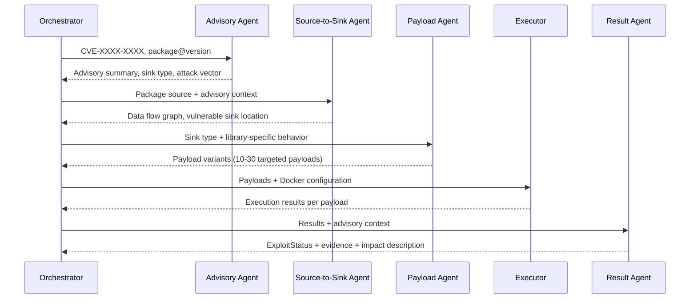

# Multi-Agent Reasoning

!!! abstract "Overview"
    TIVI's multi-agent system mimics the workflow of a Senior Security Researcher — loading advisories, tracing data flows, generating hypotheses, testing them, and interpreting results.

## Agent Coordination



## Advisory Agent

**Purpose:** Gather all available context about the vulnerability before analysis begins.

**Sources queried:**
- NVD CVE record (description, CVSS, references)
- Vendor security advisory (if available)
- GitHub Security Advisories (GHSA)
- Referenced CVE proof-of-concept publications
- Package changelog for the affected version

**Output schema:**
```python
@dataclass
class AdvisoryContext:
    cve_id: str
    description: str
    affected_versions: list[str]
    vulnerability_class: str      # e.g., "path_traversal", "deserialization"
    attack_vector: str            # e.g., "network", "local", "adjacent"
    authentication_required: bool
    user_interaction_required: bool
    sink_hints: list[str]         # keywords pointing to vulnerable code
    reference_pocs: list[str]     # URLs to public PoC references
```

## Source-to-Sink Analyzer

**Purpose:** Locate the precise data flow from untrusted input to the vulnerable operation.

**Approach:**
1. Clone the package at the affected version
2. Identify all external entry points (HTTP handlers, file readers, deserialization callsites, etc.)
3. Build a simplified call graph from each entry point
4. Trace paths reaching the sink type identified by the Advisory Agent
5. Identify input validation gaps along each path

**Output schema:**
```python
@dataclass
class DataFlowResult:
    entry_point: str              # Function/route where attacker input enters
    sink: str                     # Vulnerable operation location (file + line)
    path: list[str]               # Call chain from entry to sink
    validation_gaps: list[str]    # Missing or bypassable input validation
    attack_surface: str           # What the attacker can control
```

## Payload Generator

**Purpose:** Generate exploit payloads targeted at the specific library's behavior.

This is where the **Library-Aware** distinction matters most. Rather than using a generic payload dictionary, the agent reasons about:

- What input format does this specific entry point accept?
- What encoding does this library apply to input before reaching the sink?
- What validation does it perform, and what are its edge cases?
- What bypass techniques are known for this library's implementation?

```python
@dataclass
class PayloadSet:
    vulnerability_class: str
    library: str
    version: str
    payloads: list[Payload]       # 10-30 targeted variants
    expected_impact: str          # What successful exploitation achieves
    impact_indicator: str         # What to look for in response to confirm success
```

## Result Interpreter

**Purpose:** Parse sandbox execution output and produce a definitive exploit status.

```python
class ExploitStatus(Enum):
    CONFIRMED = "confirmed"           # Payload executed, impact achieved
    FALSE_POSITIVE = "false_positive" # No payload succeeded after exhausting all variants
    PARTIAL = "partial"               # Some payloads succeeded with conditions
    UNCONFIRMED = "unconfirmed"       # Environment prevented conclusive testing

@dataclass
class ExploitResult:
    status: ExploitStatus
    successful_payload: str | None
    impact_achieved: str | None
    reproduction_steps: list[str]
    sandbox_execution_id: str
    execution_timestamp: datetime
    confidence: float               # 0.0 - 1.0
```
