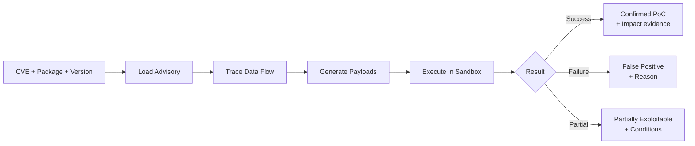

# Exploit Validation Agent — Overview

!!! abstract "Overview"
    The Exploit Validation Agent is the core of TIVI. It takes a vulnerability finding and produces a definitive answer: exploitable or not — with evidence either way.

## What the Agent Does

## Why Multi-Agent Architecture

A single LLM prompt cannot reliably perform exploit validation. The task requires:

- **Deep reading** of vendor advisories and CVE descriptions (long-context reasoning)
- **Code analysis** tracing data flows through potentially complex call graphs (specialized reasoning)
- **Creative payload generation** targeting specific library behavior (targeted generation)
- **Execution interpretation** parsing sandbox output and mapping to exploit impact (structured reasoning)

Separating these into specialized sub-agents — each with focused context and appropriate model configuration — produces dramatically more reliable results than a single monolithic prompt.

## Five Sub-Agents

| Sub-Agent | Input | Output | Model Config |
|-----------|-------|--------|-------------|
| Advisory Loader | CVE ID, package name | Structured advisory data | Gemini Flash, high context |
| Source-to-Sink Analyzer | Package source, advisory | Data flow graph, sink identification | Gemini Pro, deep reasoning |
| Payload Generator | Sink type, library behavior | Targeted payload list | Gemini Pro, creative |
| Sandbox Executor | Payloads, Docker config | Raw execution results | N/A |
| Result Interpreter | Execution results | Exploit status + evidence | Gemini Flash, structured |

## Key Design Principles

### Evidence Over Assertion

The agent never asserts exploitability based on description alone. The determination is made exclusively from sandbox execution results — either a payload achieves the claimed impact or it doesn't.

### Library-Aware Payload Generation

Before generating payloads, the agent analyzes the specific package source at the affected version. This means payloads are crafted for the actual code path, not a generic template of the vulnerability class.

### Graceful Uncertainty

If the agent cannot generate a working exploit — due to environmental constraints, missing context, or genuine non-exploitability — it returns `UNCONFIRMED` with a detailed explanation, not a false confirmation.

!!! success "Key Takeaways"
    1. Multi-agent architecture matches specialized reasoning tasks to appropriately configured models
    2. Execution-based validation eliminates the false positive problem
    3. Library-aware payload generation is what distinguishes TIVI from generic AI security tools
    4. Every output is evidence-backed — either a working exploit or a documented reason it wasn't achieved
