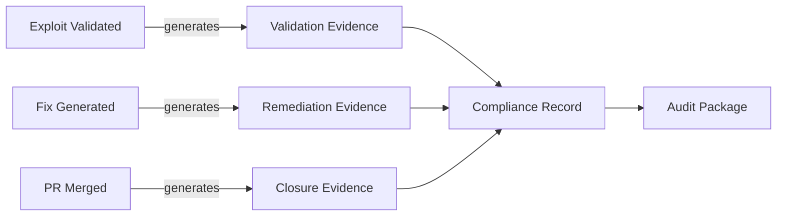

# Automated Audit Evidence

!!! abstract "Overview"
    TIVI generates timestamped, structured audit evidence automatically as developers complete remediation — eliminating manual spreadsheet assembly and reducing audit preparation from months to hours.

## Evidence Generation Trigger

Evidence is generated at three points:



## Evidence Record Schema

```json
{
  "evidence_id": "ev-uuid",
  "generated_at": "2026-04-06T14:55:22Z",
  "finding": {
    "id": "finding-uuid",
    "cve_id": "CVE-2025-XXXX",
    "package": "example@2.1.0",
    "vulnerability_class": "injection"
  },
  "validation": {
    "status": "CONFIRMED",
    "execution_id": "exec-uuid",
    "timestamp": "2026-04-06T10:23:11Z",
    "sandbox_container_id": "sha256:abc...",
    "duration_seconds": 193
  },
  "remediation": {
    "task_id": "task-uuid",
    "fix_type": "code_change",
    "pr_url": "https://github.com/.../pull/42",
    "merged_by": "developer@org.com",
    "merged_at": "2026-04-06T14:55:00Z"
  },
  "compliance": {
    "frameworks": {
      "NIST_SSDF": ["RV.1.3", "RV.2.1", "RV.2.2", "RV.3.1"],
      "SLSA": ["L2-signed-provenance"],
      "OpenSSF": ["Vulnerabilities"]
    }
  },
  "hash": "sha256:def456..."
}
```

## Audit Report Generation

```bash
# Generate audit package for a compliance review
python src/reporting/audit_reporter.py \
  --framework nist-ssdf \
  --date-range 2026-01-01:2026-03-31 \
  --output reports/Q1_2026_NIST_SSDF_evidence.pdf

# Generate OpenSSF Scorecard improvement report
python src/reporting/audit_reporter.py \
  --framework openssf-scorecard \
  --repository github.com/org/repo \
  --output reports/openssf_scorecard_improvements.pdf
```

## Continuous Compliance Dashboard

Rather than point-in-time audit preparation, TIVI maintains a live compliance posture:

| Framework | Current Coverage | Trend | Last Updated |
|-----------|-----------------|-------|-------------|
| NIST SSDF | 23/37 tasks satisfied | ↑ +3 this month | Today |
| SLSA | Level 2 | ↑ from Level 1 | 2026-03-15 |
| OpenSSF Scorecard | 7.2/10 | ↑ +0.8 this quarter | Today |

!!! success "Key Takeaway"
    Compliance evidence generated as a byproduct of remediation is more accurate, more complete, and orders of magnitude cheaper than evidence assembled manually for annual audits.
