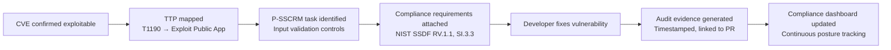

# Compliance Automation — Overview

!!! abstract "Overview"
    TIVI transforms compliance from an annual audit exercise into a continuous, automated process where evidence is generated as a byproduct of remediation — not a separate activity.

## The Compliance Problem

Organizations spend **$300K–$700K annually** on manual compliance processes:

- Mapping security findings to framework requirements in spreadsheets
- Assembling audit evidence packages every 6–12 months
- Dedicating 2–4 months per audit cycle to evidence collection
- Maintaining separate compliance teams alongside security teams

TIVI eliminates this by attaching compliance context to every Security Task and generating audit evidence automatically when developers complete remediation.

## Supported Frameworks

| Framework | Coverage |
|-----------|---------|
| NIST SSDF (SP 800-218) | Full task mapping — all 4 practices, 37 tasks |
| SLSA (Supply-chain Levels for Software Artifacts) | Levels 1–3 |
| OpenSSF Scorecard | All 18 checks |
| BSIMM | Key practice areas |
| OWASP SAMM | Maturity model integration |

## How It Works

## Compliance Modules

| Module | Description |
|--------|-------------|
| [NIST SSDF Mapping](nist_ssdf.md) | Full P-SSCRM to SSDF requirement mapping |
| [SLSA & OpenSSF](slsa_openssf.md) | Supply chain security framework coverage |
| [Automated Evidence](audit_evidence.md) | How evidence is generated and formatted |
