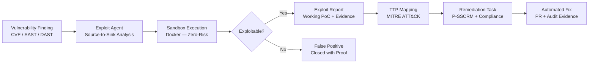

# Threat-Informed Vulnerability Intelligence

!!! abstract "What This Is"
    A platform for **proving** vulnerabilities, not just finding them.

    Threat-Informed Vulnerability Intelligence (TIVI) connects static security findings to real-world attack evidence — generating working proof-of-concept exploits in isolated sandboxes, mapping findings to MITRE ATT&CK techniques, and producing compliance-ready remediation tasks. It transforms security from a **cost center** into a **velocity enabler**.

---

## The Core Shift

| Old Model | TIVI Model |
|-----------|-----------|
| "We found 2,847 vulnerabilities" | "We identified 12 that enable the same supply chain injection used in SolarWinds" |
| CVSS score determines priority | Exploitation evidence determines priority |
| Developer gets a CVE number | Developer gets a proof, a fix, and a compliance mapping |
| Manual triage: 4–6 hours per finding | Automated validation: ~193 seconds |
| 68% of findings ignored | Evidence-backed findings acted on |

!!! quote "The Winning Narrative"
    In 2024, the world wanted to see their risks. In 2026, the world wants to **prove and fix them**. While the industry is still drawing maps, this platform provides the cure.

---

## How It Works

---

## Core Value Pillars

### Exponential Triage Speed

Manual vulnerability validation takes 4–6 hours per finding. TIVI reduces this to ~193 seconds through automated source-to-sink tracing, payload generation, and sandbox execution.

For a Global 2000 enterprise with thousands of microservices and tens of thousands of open findings, this represents **millions of dollars in recovered engineering productivity**.

### The Evidence-Based Standard

Generic AI security tools guess. TIVI **proves**.

By generating a working PoC within the context of the specific package and version — inside a secure, isolated Docker sandbox — TIVI provides the definitive evidence required to:

- Eliminate "it's not a real bug" arguments
- Justify immediate remediation priority
- Provide developers with concrete reproduction steps
- Satisfy audit requirements for vulnerability validation

This is what we call the **Library-Aware** approach: the exploit agent understands the specific library, framework, and runtime context before generating payloads. It does not hallucinate exploits that wouldn't work.

### Multi-Agent Reasoning

TIVI uses Google Gemini's deep reasoning capability in a multi-agent architecture that mimics the workflow of a Senior Security Researcher:

1. **Advisory Agent** — loads CVE data, vendor advisories, and reference content
2. **Analysis Agent** — traces data flow from untrusted input (source) to dangerous operation (sink)
3. **Payload Agent** — generates targeted exploit payloads for the specific library context
4. **Validation Agent** — executes payloads in sandbox and interprets results
5. **Remediation Agent** — generates fix, maps to compliance frameworks, prepares PR

### Safe-by-Design Execution

All exploit execution happens inside isolated Docker containers with:

- No network access to production systems
- Ephemeral filesystems destroyed after each run
- Resource limits preventing runaway processes
- Audit logs of every execution

This makes exploit validation a **zero-risk activity** — enterprise-ready for production-scale environments.

---

## What You Get Per Finding

For each vulnerability processed by TIVI:

| Output | Description |
|--------|-------------|
| **Exploit Status** | Confirmed exploitable / False positive / Partially exploitable |
| **Working PoC** | Step-by-step reproduction proof (if exploitable) |
| **MITRE ATT&CK Mapping** | Which technique(s) this vulnerability enables |
| **Breach Correlation** | Which real-world incidents used the same technique |
| **Remediation Task** | Developer-ready fix with clear security outcome |
| **Compliance Mapping** | NIST SSDF / SLSA / OpenSSF requirements addressed |
| **Audit Evidence** | Timestamped record for compliance reporting |

---

## Research Foundation

TIVI is grounded in peer-reviewed academic research:

!!! quote "Source"
    Akhoundali et al., *"Eradicating the Unseen: Detecting, Exploiting, and Remediating a Path Traversal Vulnerability across GitHub"*, AsiaCCS 2025.
    [https://dl.acm.org/doi/10.1145/3708821.3736220](https://dl.acm.org/doi/10.1145/3708821.3736220)

The validated TTP-to-task mappings incorporated in TIVI are derived from research analyzing **106 breach reports** across four independent validation methodologies, producing **251 high-confidence mappings** agreed upon by at least three methods.

---

!!! tip "Get Started"
    - **Understand the problem** → [The Problem](introduction/the_problem.md)
    - **See the architecture** → [Architecture Overview](introduction/architecture.md)
    - **Run it yourself** → [Quick Start](setup/quickstart.md)
