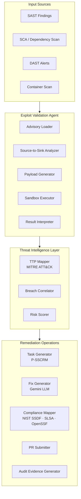

# Architecture Overview

!!! abstract "Overview"
    TIVI is a multi-agent pipeline. Each stage hands enriched output to the next — from raw vulnerability finding to validated exploit, TTP mapping, remediation task, and compliance evidence.

## High-Level Architecture



## Five-Stage Pipeline

### Stage 1: Vulnerability Intake

TIVI accepts findings from any security tool via a standard JSON schema:

```json
{
  "finding_id": "uuid",
  "source": "sast|sca|dast|container",
  "cve_id": "CVE-YYYY-NNNN",
  "cwe_id": "CWE-NNN",
  "package": "package-name@version",
  "language": "python|javascript|java|go|...",
  "affected_file": "src/...",
  "affected_line": 42,
  "description": "..."
}
```

### Stage 2: Exploit Validation Agent

A five-sub-agent system executes sequentially:

| Sub-Agent | Role | Model |
|-----------|------|-------|
| Advisory Loader | Fetches CVE advisories, vendor bulletins, reference content | Gemini Flash |
| Source-to-Sink Analyzer | Traces untrusted input through code to vulnerable sink | Gemini Pro |
| Payload Generator | Creates targeted exploit payloads for the specific package | Gemini Pro |
| Sandbox Executor | Runs payloads in isolated Docker container | N/A (execution) |
| Result Interpreter | Parses sandbox output, determines exploit status | Gemini Flash |

### Stage 3: Threat Intelligence Enrichment

Confirmed findings are enriched with:

- MITRE ATT&CK technique mapping (from 251 validated mappings)
- Real-world breach correlation (which incidents used this technique)
- Composite risk score (exploitation evidence + asset criticality)

### Stage 4: Remediation Operations

For each confirmed finding:

1. **Task generation** — groups related findings into a single developer-facing Security Task with clear outcome
2. **Fix generation** — Gemini synthesizes a targeted code fix for the specific library and context
3. **Compliance mapping** — automatically attaches relevant NIST SSDF, SLSA, OpenSSF requirements
4. **PR preparation** — generates the patch, test update, and PR description

### Stage 5: Audit Evidence

Every completed finding generates a timestamped record:

```json
{
  "finding_id": "...",
  "validation_status": "confirmed_exploitable",
  "exploit_timestamp": "2026-04-06T10:23:11Z",
  "sandbox_execution_id": "...",
  "ttp_mapping": ["T1190", "T1059"],
  "compliance_satisfied": ["NIST-SSDF-RV.1.1", "SLSA-L2"],
  "fix_applied": true,
  "pr_url": "https://github.com/...",
  "remediation_timestamp": "2026-04-06T10:25:44Z"
}
```

## Performance Characteristics

| Metric | Manual Process | TIVI Automated |
|--------|---------------|----------------|
| Time per finding validation | 4–6 hours | ~193 seconds |
| False positive rate | High (unvalidated) | Near-zero (execution-proven) |
| Compliance mapping | Manual, per-audit | Continuous, automated |
| Developer context provided | CVE number only | PoC + fix + compliance |
