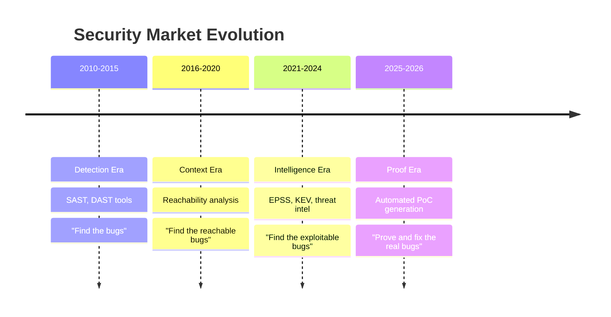

# From Detection to Proof

!!! abstract "Overview"
    The security industry spent a decade building better detection. TIVI is built on the premise that detection is no longer the bottleneck — **validation and remediation** are.

## The Market Evolution

## What "Proof" Means in Practice

The standard today is **context** — where is the bug, is it reachable, what is its severity? TIVI's standard is **validation** — does an exploit actually work against this package, in this version, in this runtime context?

| Capability | Context (Current Standard) | Validation (TIVI) |
|------------|--------------------------|-------------------|
| Vulnerability location | ✓ | ✓ |
| Reachability analysis | ✓ | ✓ |
| Severity score | ✓ | ✓ |
| Working exploit | ✗ | ✓ |
| False positive confirmation | ✗ | ✓ |
| Attacker impact proof | ✗ | ✓ |
| Developer-actionable evidence | ✗ | ✓ |

## The Library-Aware Difference

Generic AI security tools generate exploits based on vulnerability descriptions — they produce plausible-looking PoCs that may not actually work against the specific library version in question.

TIVI's exploit agent is **Library-Aware**: before generating a single payload, it:

1. Loads the actual package source at the affected version
2. Traces the specific data flow from entry point to vulnerable sink
3. Identifies the exact input validation gaps in this implementation
4. Generates payloads targeted at this library's specific behavior

The result: a PoC that either works (confirming real risk) or doesn't (confirming false positive). No hallucination. No guessing.

!!! success "The Anti-Hallucination Guarantee"
    TIVI only reports a vulnerability as confirmed when a payload executes successfully in a controlled sandbox and achieves the claimed impact. If it cannot generate a working exploit, it reports the finding as unconfirmed — giving developers the context to make an informed decision rather than acting on speculation.

## RemOps: The New Category

TIVI establishes **Remediation Operations (RemOps)** as a distinct practice alongside DevOps and SecOps.

RemOps treats vulnerability remediation as a scalable workflow discipline:

- **Automated intake** — vulnerability findings from any source (SAST, DAST, SCA, container scanning)
- **Evidence generation** — exploit validation and TTP mapping
- **Task orchestration** — grouping related findings into developer-ready remediation tasks
- **Compliance integration** — attaching regulatory context to each task automatically
- **Audit trail** — timestamped evidence of what was fixed, when, and how

This positions security as a **velocity enabler** — embedding into developer workflows rather than creating separate security queues that developers ignore.

!!! success "Key Takeaways"
    1. The bottleneck has shifted from detection to validation and remediation
    2. "Context" (where the bug is) is table stakes; "Validation" (does the exploit work) is the differentiator
    3. Library-Aware exploit generation eliminates the false positive problem that causes developer disengagement
    4. RemOps is the operational framework for making security remediation a scalable, measurable discipline
