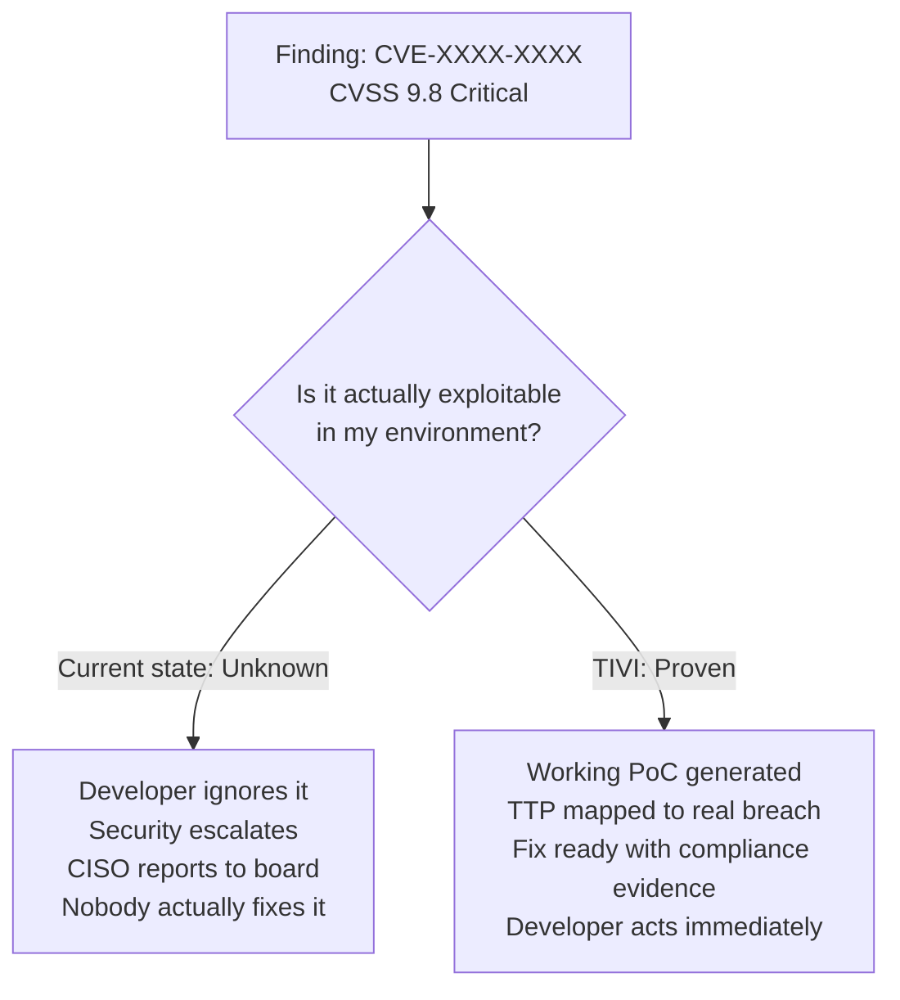

# The Problem

!!! abstract "Overview"
    Three interconnected failures make vulnerability management fundamentally broken at enterprise scale.
    TIVI addresses all three simultaneously.

## Problem 1: Prioritization is Broken

Security teams receive thousands of vulnerability findings and have no defensible way to choose what to fix first.

The industry default — CVSS severity scores — measures **theoretical impact**, not **real-world exploitation likelihood**. The result is predictable:

!!! warning "The CVSS Trap"
    Research shows **85% of CVEs are never exploited in the wild** — yet many receive "Critical" ratings that consume limited remediation resources. Teams spend months chasing theoretical risks while genuinely exploited vulnerabilities wait.

A representative enterprise reported 2,847 open vulnerabilities with capacity for 30 fixes per month. At that rate, the remediation backlog runs **95 months**. When boards ask which vulnerabilities to prioritize, security leaders cannot provide a defensible, data-driven answer.

**The fix:** Replace severity-based priority with exploitation evidence. A confirmed, working exploit is the only signal that matters.

## Problem 2: Developer Trust is at Zero

68% of security findings are ignored or indefinitely delayed by development teams.[^1]

The reason is simple: developers receive a CVE number and an instruction to "update to version X." Without understanding:

- Whether the vulnerability is actually exploitable in their context
- What an attacker could concretely achieve
- Why this specific finding matters more than the other 2,000

...the security ticket sits at the bottom of the backlog. Security teams create noise. Developers rationally ignore it.

**The fix:** Replace vulnerability reports with exploitation evidence. A working PoC demonstrates the risk in terms developers understand and cannot reasonably dismiss.

## Problem 3: Compliance Consumes Resources Without Improving Security

Organizations must satisfy frameworks including NIST SSDF, SLSA, BSIMM, and OpenSSF Scorecard for audits, customer requirements, and regulatory obligations.

Current approaches require:

| Activity | Cost |
|----------|------|
| Manual spreadsheet mapping: findings → framework requirements | $300K–$700K annually[^2] |
| Audit preparation cycles | 2–4 months per cycle |
| Dedicated compliance team headcount | 3–6 FTEs |

Despite this investment, organizations cannot automatically prove which security controls address which requirements — or demonstrate continuous compliance between annual audits.

**The fix:** Automate compliance evidence generation as a byproduct of remediation, not a separate activity.

## The Convergence Point

These three problems share a root cause: **the gap between finding a vulnerability and proving what it means**.

TIVI closes this gap by transforming vulnerability findings into exploitation evidence — at machine speed, at enterprise scale.

[^1]: Based on industry research cited in [Threat-Informed Vulnerability Intelligence research foundation](research_foundation.md).
[^2]: Compliance cost estimates from enterprise security operations research.
