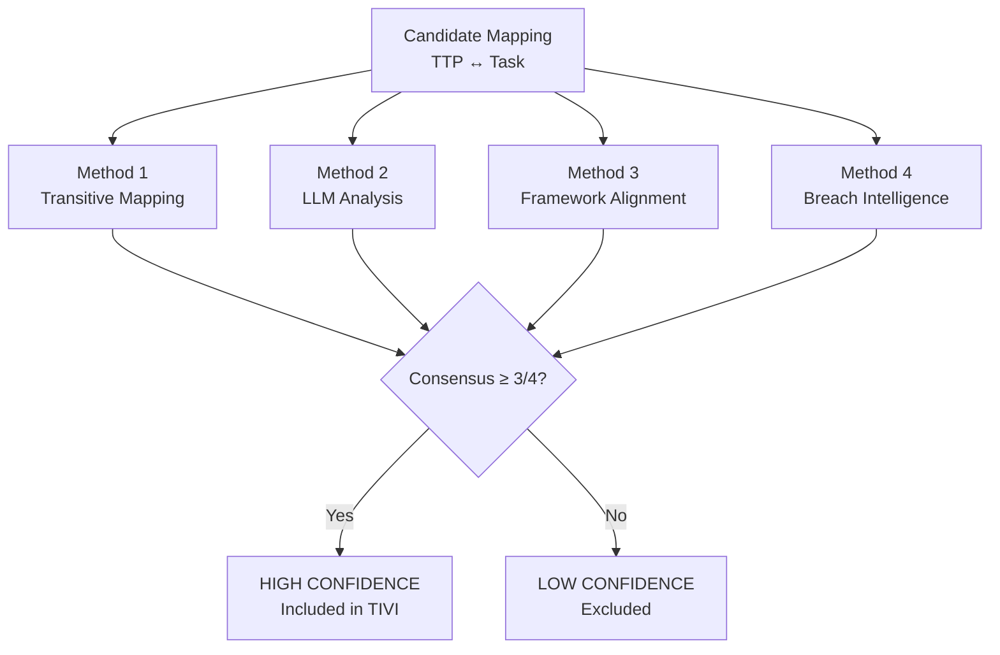

# Validated Mappings

!!! abstract "Overview"
    The 251 high-confidence TTP-to-task mappings are the intelligence core of TIVI. This page documents the validation methodology and provides a sample of the mapping dataset.

## Validation Methodology

!!! quote "Source"
    Mapping methodology derived from academic research analyzing 106 breach reports.
    See [Research Foundation](../introduction/research_foundation.md) for full citation.

A mapping is classified as **high-confidence** when it achieves consensus across at least 3 of these 4 independent methods:

## Confidence Levels

| Level | Methods Agreeing | Count | Usage |
|-------|-----------------|-------|-------|
| High | 4/4 | 89 | Automatic prioritization |
| High | 3/4 | 162 | Automatic prioritization |
| Medium | 2/4 | ~340 | Shown with uncertainty flag |
| Low | 1/4 | ~580 | Not shown by default |

## Sample Mappings (High Confidence)

| ATT&CK Technique | P-SSCRM Task | Confidence | Methods |
|-----------------|--------------|-----------|---------|
| T1195.001 Supply Chain Compromise | Implement code signing | 4/4 | All |
| T1190 Exploit Public-Facing App | Input validation controls | 4/4 | All |
| T1059.007 JavaScript Execution | Implement CSP headers | 4/4 | All |
| T1552.001 Credentials in Files | Secrets scanning in CI | 3/4 | Trans, LLM, Breach |
| T1078 Valid Accounts | MFA enforcement | 4/4 | All |
| T1083 File & Dir Discovery | Path normalization | 3/4 | Trans, Framework, Breach |
| T1005 Data from Local System | Least-privilege file access | 4/4 | All |
| T1090 Proxy/SSRF | Allowlist for outbound requests | 3/4 | Trans, LLM, Framework |
| T1040 Network Sniffing | TLS enforcement | 4/4 | All |
| T1199 Trusted Relationship | Dependency integrity verification | 3/4 | Trans, Framework, Breach |

## Keeping Mappings Current

TIVI updates its mapping dataset on the following schedule:

| Event | Update Action |
|-------|--------------|
| MITRE ATT&CK release (bi-annual) | Re-run validation for affected techniques |
| Major breach report published | Extract and validate new technique-task pairs |
| New CWE entries | Map new weakness types to existing techniques |
| NIST SSDF / SLSA revision | Re-validate framework alignment for affected mappings |
